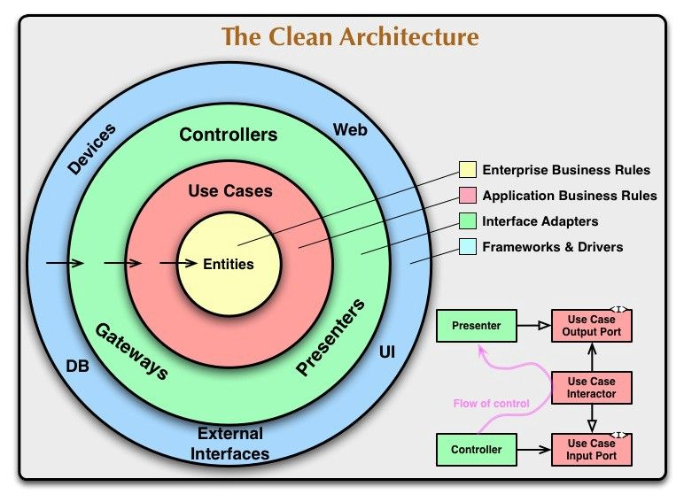
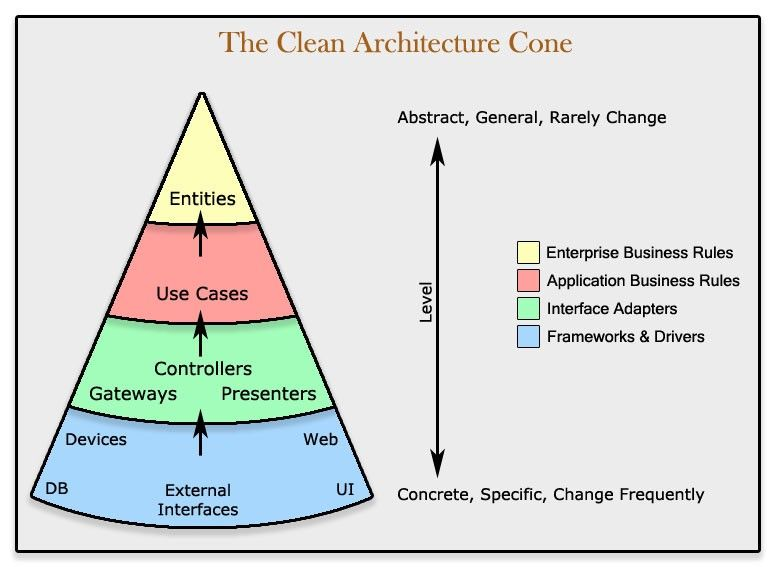
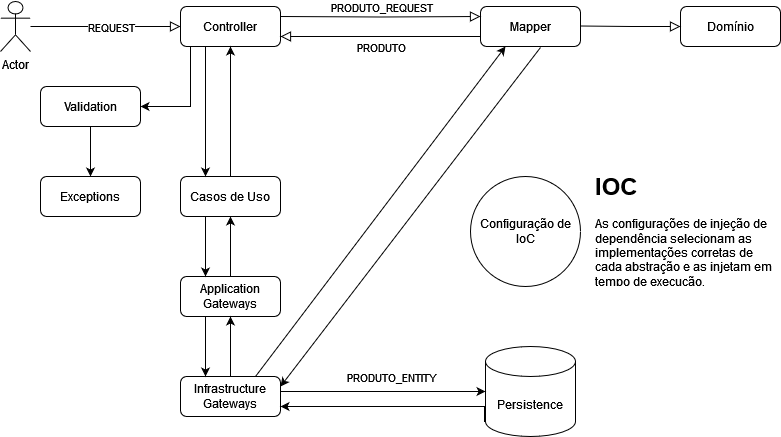

# Desafio Produtos de Seguros 

Projeto de implementação de serviço REST baseado nas idéias e conceitos do livro "Arquitetura Limpa" do autor [Robert C. Martin (Uncle Bob)](https://pt.wikipedia.org/wiki/Robert_Cecil_Martin) com o objetivo de atender aos requisitos do desafio do produto de seguros conforme descrito no arquivo [README do Desafio](https://github.com/mateus-amaral-projects/backend-challenge/blob/main/README_Desafio.md).<br>

<div style="text-align: center;">
	
	

Fontes, Créditos e Referências:
[Uma breve introdução à arquitetura limpa](https://www.freecodecamp.org/portuguese/news/uma-breve-introducao-a-arquitetura-limpa/)

</div>

## Índice

* [Pré-requisitos](#pre-requisitos)
* [Como executar o projeto](#como-executar-o-projeto)
* [Como executar os testes](#como-executar-os-testes)
* [Invocação dos serviços](#invocação-dos-serviços)
* [Tecnlogias utilizadas](#tecnologias-utilizadas)
* [Detalhes da Solução](#detalhes-da-solução)
* [Licença](#licença)

## <a name="pre-requisitos">Pré-requisitos de ambiente</a> 

Para que seja possível consumir o projeto é necessário este ambiente mínimo:

- [Java 17+](https://www.youtube.com/watch?v=w-D6hWXFcXw)

- [Maven 3+](https://www.youtube.com/watch?v=rfhTnfbBQcY)

- [Git 2+](https://www.youtube.com/watch?v=mmcOw2ynWEs)

- [Curl](https://www.youtube.com/watch?v=uMpSopmy2mc)
	
## <a name="como-executar-o-projeto">Como executar o projeto</a>

Abra o terminal no sistema operacional local:

```
No Ubuntu "Ctrl + Alt + T", no Windows "WINDOWS + R" e, em seguida, digite "cmd.exe". No MacOS pressione "Command + Espaço". 
```

[Clone](https://docs.github.com/pt/repositories/creating-and-managing-repositories/cloning-a-repository#cloning-a-repository) o repositório:

```
git clone https://github.com/mateus-amaral-projects/backend-challenge.git

```
Construa o arquivo do projeto:

```
mvn clean package

```
Inicialize o projeto (Localize o artefato na pasta target; Em sistemas Windows, caso seja solicitado, forneça as permissões de firewall):

```
java -jar backend-challenge-0.0.1-SNAPSHOT.jar

```
## <a name="como-executar-os-testes">Como executar os testes</a>

Para executar os testes unitários e de integração:

```
mvn test

```

## <a name="invocação-dos-serviços">Invocação dos serviços</a>

O serviço de **criar produto** pode ser consumido neste endpoint:

```
curl --request POST \
  --url http://localhost:8080/v1/seguros/produto \
  --header 'Content-Type: application/json' \
  --data '{
	  "nome": "Seguro de Vida Padrão",
   	  "categoria": "VIDA",
   	  "preco_base": 50
	}'

```

O serviço de **alterar produto** pode ser consumido neste endpoint:

```
curl --request POST \
  --url http://localhost:8080/v1/seguros/produto \
  --header 'Content-Type: application/json' \
  --data '{
     "id": "a0fe6d7d-b857-4e64-8e04-f4b167bb2a94",
	  "nome": "Seguro de Vida Coletivo",
     "categoria": "VIDA",
     "preco_base": 799.90
	}'
```

A **console do banco de dados H2** pode ser acessada neste endereço:<br>
(Atualize o campo **JDBC_URL** para <font color="#9900FF">jdbc:h2:./src/main/resources/insurance)</font>

```
http://localhost:8080/h2-console/
```

## <a name="tecnologias-utilizadas">Tecnlogias utilizadas</a>

* [Eclipse IDE](https://eclipseide.org/): O Eclipse é um ambiente de desenvolvimento utilizado para programação oferecendo recursos de edição de código, depuração e controle de versão.
* [Apache Maven](https://maven.apache.org/): Apache Maven é uma ferramenta de automação que facilita o processo de compilação, testes, empacotamento e distribuição.
* [Spring Boot](https://spring.io/projects/spring-boot/): Spring Boot é um framework que facilita o desenvolvimento oferecendo configurações automáticas e um ambiente de execução simplificado.
* [Spring JPA](https://spring.io/projects/spring-data-jpa): Spring JPA é uma camada de abstração que simplifica o acesso a bancos de dados por meio de anotações e interfaces.
* [Spring Testing](https://docs.spring.io/spring-framework/reference/testing.html): Spring Test é um módulo do Framework que fornece suporte para testes unitários e de integração, facilitando a escrita e execução de testes automatizados.
* [H2 Database](https://www.h2database.com/html/main.html): O H2 Database é um banco de dados frequentemente usado para desenvolvimento, testes e prototipagem de aplicativos.
* [Mockito](https://site.mockito.org/): Mockito é um framework que permite criar objetos simulados (mocks) para testar o comportamento de classes e métodos isoladamente. 
* [Gson](https://github.com/google/gson): Gson é uma biblioteca Java desenvolvida pela Google para serializar e desserializar objetos Java em JSON e vice-versa. 

## <a name="detalhes-da-solução">Detalhes da solução</a>

O fluxo de trabalho ocorre da seguinte forma:

<div style="text-align: center;">
	
</div>

	1.Requisição HTTP
	O processo começa quando um "client" (por exemplo, um navegador ou aplicativo móvel) faz uma requisição HTTP para uma rota específica
	em nosso aplicativo exposta por um controller. Essa rota é mapeada em controller na camada de infraestrutura, que é a camada mais 
	externa da aplicação.
	
	2.Controller
	O controller é responsável por receber a requisição HTTP e interpretá-la. Ele extrai os parâmetros da requisição, valida-os e chama o
	caso de uso apropriado. Em nossa aplicação o controller também possui o papel de orquestrar a transformação das entidades na 
	requisição para entidades do negócio e vice-versa, assim como para as entidades na resposta da requisição.
	
	3.Caso de Uso(Use Case)
	O caso de uso (ou use case) é a camada intermediária que mantém a lógica de negócios. Ele não sabe nada sobre a infraestrutura ou 
	detalhes de implementação. O controller invoca o caso de uso relevante com os parâmetros da requisição. Os casos de uso consomem as 
	classes de domínio e compõem as abstrações que devem ser implementadas pela infraestrutura.
	
	4.Camada de Domínio(Domain)
	O caso de uso interage com a camada de domínio. Aqui, as regras de negócio podem ser aplicadas como no caso de nossa aplicação, onde 
	ocorre o cálculo do preço tarifado na entidade Produto. Validação de regras de negócio também podem ocorrer nesta camada.
	
	5.Gateway (Adaptadores)
	O caso de uso pode precisar interagir com fontes externas, como bancos de dados ou serviços de terceiros. Os gateways (ou adaptadores) 
	são responsáveis por essa comunicação. Eles traduzem os objetos de domínio para estruturas compreensíveis pela infraestrutura externa.
	
	6.Camada de Infraestrutura (Infrastructure)
	A camada de infraestrutura contém os detalhes técnicos e tecnológicos. Ela inclui os adaptadores para o banco de dados, serviços de 
	terceiros, etc. O gateway de persistência (responsável pela comunicação com o banco de dados) entra em ação aqui.
	
	7.Resposta HTTP:
	O controller recebe a resposta do caso de uso e a redireciona para o output. Ele formata a resposta em um formato adequado (por 
	exemplo, JSON) e a envia de volta ao cliente como uma resposta HTTP. Um detalhe importante de mencionar é que a abstração do caso de 
	uso recebe a implementação adequada na infraestrutura, em tempo de execução, pela configuração de injeção de dependência da nossa 
	aplicação.

## <a name="licença">Licença</a>

Esse projeto é licenciado nos termos da licença open-source [MIT](https://choosealicense.com/licenses/mit) e está disponível de graça.
