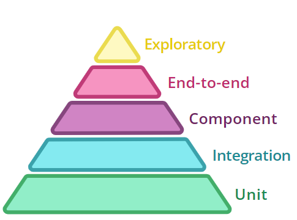
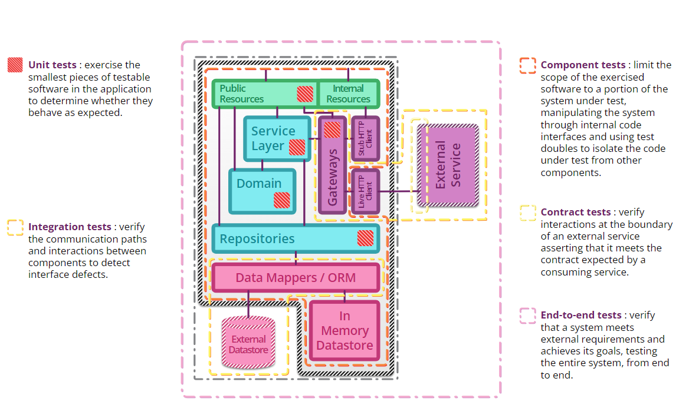

# Desafio Produtos de Seguros 🚀

## Resumo
* [Desafio](#desafio)
    * [Pontos que daremos mais atenção](#pontos_atencao)
    * [Pontos que não iremos avaliar](#pontos_sem_avaliacao)
    * [Observações importantes](#observacoes)
* [Sobre a documentação](#about_docs)
    * [Como esperamos receber sua solução](#como_esperamos_receber)
* [Dicas](#dicas)

### <a name="desafio">Desafio</a>
Você foi designado para construir uma API REST capaz de calcular o preço tarifado de um produto de seguros a partir do preço base informado.

O cálculo deve ocorrer durante a criação ou alteração do produto com base em sua tributação.

Para isto é necessário considerar as informações abaixo.

Todo produto deve ter os atributos:
- ID
- Nome
- Categoria
- Preço Base
- Preço Tarifado

**Exemplo de Requisição**

```json
{
    "nome": "Seguro de Vida Individual",
    "categoria": "VIDA",
    "preco_base": 100.00
}
```

**Exemplo de Resposta**

```json
{
    "id": "8cfb5eb2-fd93-4322-bb74-c82f27c95a47",
    "nome": "Seguro de Vida Individual",
    "categoria": "VIDA",
    "preco_base": 100.00,
    "preco_tarifado": 106.00
}
```

Após o cálculo é necessário salvar ou atualizar o produto em uma base de dados de sua preferência (SQL ou NoSQL, podendo ser inclusive um banco de dados em memória como H2 ou HSQLDB).

O preço tarifado deve ser calculado pela API e ignorado caso seja enviado através da requisição, ou seja, caso o corpo da requisição contenha o campo preço tarifado, o mesmo deve ser ignorado.

Os produtos de seguros podem pertencer as seguintes categorias:
- VIDA
- AUTO
- VIAGEM
- RESIDENCIAL
- PATRIMONIAL
  
Os impostos devem ser aplicados da seguinte forma:


| **Categoria** | **Imposto sobre Operação Finaneira (IOF)** | **Programa de Integração Social (PIS)** | **Contribuição para o Financiamento da Seguridade Social (COFINS)** |
|---------------|--------------------------------------------|-----------------------------------------|----------------------------------------------------------------|
| VIDA          | 1%                                         | 2.2%                                      | Não há                                                          |
| AUTO          | 5.5%                                       | 4%                                      | 1%                                                             |
| VIAGEM        | 2%                                         | 4%                                      | 1%                                                             |
| RESIDENCIAL   | 4%                                         | Não há                                | 3%                                                             |
| PATRIMONIAL   | 5%                                         | 3%                                      | Não há                                                           |


**Fórmula**

**Preço Tarifado** = Preço Base + (Preço Base x IOF) + (Preço Base x PIS) + (Preço Base x COFINS)

**Exemplos**

Seguro de Vida com preço informado de **R$ 100.00**

**Preço tarifado**: 100.00 + (100.00 x 0.01) + (100.00 x 0.022) + (100.00 x 0.00) = R$ 103,20

Seguro Auto com preço informado de **R$ 50.00**

**Preço tarifado**: 50.00 + (50.00 x 0.055) + (50.00 x 0.04) + (50.00 x 0.01) = R$ 55,25

### <a name="pontos_atencao">Pontos que daremos mais atenção</a>
- Testes de unidade e integração
- Cobertura de testes (Code Coverage)
- Arquitetura utilizada
- Abstração, acoplamento, extensibilidade e coesão
- Profundidade na utilização de Design Patterns
- Clean Architecture
- Clean Code
- SOLID
- Documentação da Solução no README.md
- Observabilidade (métricas, traces e logs)

### <a name="pontos_sem_avaliacao">Pontos que não iremos avaliar</a>
- Dockerfile
- Scripts CI/CD
- Collections do Postman, Insomnia ou qualquer outra ferramenta para execução

## <a name="about_docs">Sobre a documentação</a>
Nesta etapa do processo seletivo queremos entender as decisões por trás do código, portanto é fundamental que o README.md tenha algumas informações referentes a sua solução.

Algumas dicas do que esperamos ver são:
- Instruções básicas de como executar o projeto
- Detalhes sobre a solução, gostaríamos de saber qual foi o seu racional nas decisões
- Caso algo não esteja claro e você precisou assumir alguma premissa, quais foram e o que te motivou a tomar essas decisões

### <a name="como_esperamos_receber">Como esperamos receber sua solução</a>
Esta etapa é eliminatória, e por isso esperamos que o código reflita essa importância.

Se tiver algum imprevisto, dúvida ou problema, por favor entre em contato com a gente, estamos aqui para ajudar.

Atualmente trabalhamos com a stack Java/Spring, porém você pode utilizar a tecnologia de sua preferência.

Para candidatos externos nos envie o link de um repositório público com a sua solução e para candidatos internos o projeto em formato .zip

### <a name="observacoes">Observações importantes</a>

Não é necessário parametrizar os impostos em arquivos de configuração ou persisti-los em base de dados.
Os campos a serem persistidos devem ser somente os informados no <a name="desafio">desafio</a>.

## <a name="dicas">Dicas</a>

Aqui vão algumas dicas que podem ser úteis.

### <a name="testes">Testes</a>
Como item opcional de leitura, deixamos este artigo rápido sobre testes [Testing Strategies in a Microservice Architecture](https://martinfowler.com/articles/microservice-testing/).

Nele é possível ver a diferença entre os principais tipos de teste.



Também há um exemplo para cada tipo de teste no artigo que pode ajudar no desafio.


